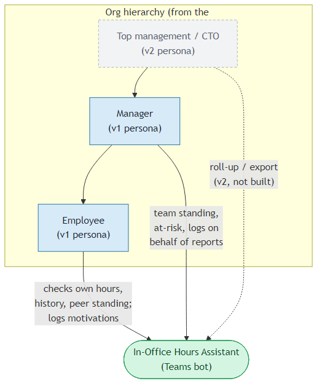
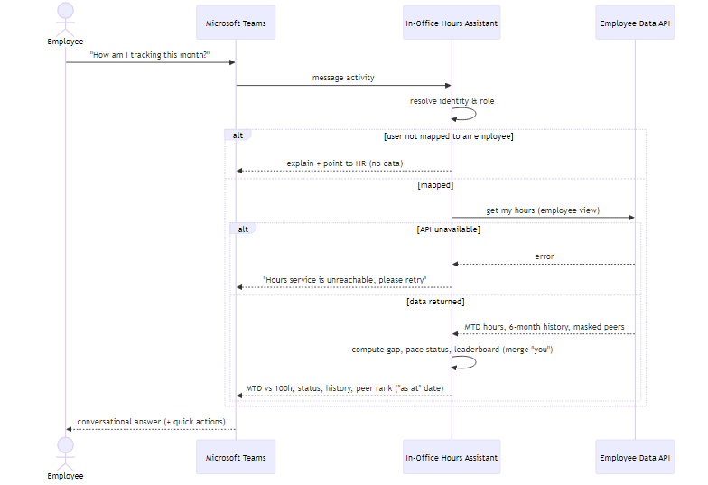
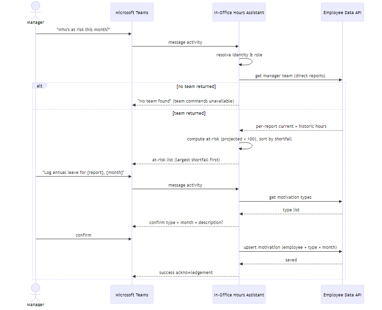
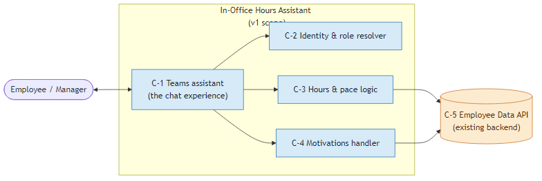
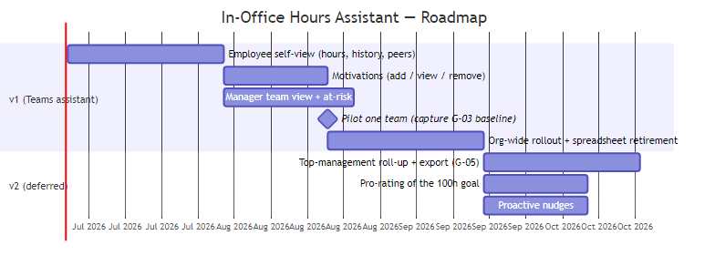

# Product Specification: In-Office Hours Assistant

---

## 1. 📋 Document Control

| Field | Value |
|-------|-------|
| **Version** | 1.1.0 |
| **Status** | ✅ APPROVED |
| **Created** | 2026-06-30 |
| **Last Modified** | 2026-06-30 |
| **Author(s)** | SibusisoSik |

### 📝 Changelog

| Version | Date | Changes | Changed By |
|---------|------|---------|------------|
| 1.0.0 | 2026-06-30 | Initial assembled product spec, materialised from prior plan-mode capture | SibusisoSik |
| 1.1.0 | 2026-06-30 | Review pass: glossary (API/TLS/RACI/PII/CI-CD); G-05 → v2 future objective; NFR-1 p95 → 8s; AC-1 & AC-6 validated + AC-2 pre-build gate | SibusisoSik |

### 🗂️ Sub-spec sign-off ledger

| Sub-spec | File | Version | Approved By | Role | Approval Date |
|----------|------|---------|-------------|------|---------------|
| Problem & Goals | `problem-and-goals.md` | 1.1.0 | SibusisoSik | Product Manager | 2026-06-30 |
| Scope | `scope.md` | 1.0.0 | SibusisoSik | Product Manager | 2026-06-30 |
| Requirements | `requirements.md` | 1.0.0 | SibusisoSik | Product Manager | 2026-06-30 |
| Risks & Assumptions | `risks-and-assumptions.md` | 1.1.0 | SibusisoSik | Product Manager | 2026-06-30 |

---

## 2. 📖 Glossary of Terms & Abbreviations

| Abbreviation / Term | Full Form | Definition |
|---------------------|-----------|------------|
| MTD | Month-to-date | Hours accumulated from the start of the current calendar month up to the latest available day |
| In-office hours | — | Time on site recorded from the source system, expressed in hours |
| 100h goal | — | The monthly in-office target of 100 hours per calendar month |
| On-pace / behind / at-risk | — | A status from the working-day-linear pace rule: behind = below expected so far; at-risk = projected month-end total below 100 |
| Motivation | — | A logged explanation (by leave/absence type) for a month in which the 100h goal was not met |
| Peer / player | — | An anonymised teammate, masked as `player1`, `player2`, … in the data |
| Leaderboard | — | A ranked list of a team's current-month hours, anonymised, with the requesting employee highlighted |
| Employee | — | A TFG Infotech staff member expected to do 100h/month (v1 role) |
| Manager | — | A line manager of a team of employees (v1 role) |
| CTO / Top management | — | An org leader above Manager in the hierarchy (v2 persona) |
| Employee Data API | — | The existing `Tfg.HrSystems.EmployeeData` backend that is the source of hours, peers, motivations |
| Teams | Microsoft Teams | The chat platform in which the assistant is delivered |
| Identity-aware | — | The bot identifies the signed-in Teams user (and derives their role) rather than asking for an employee number |
| API | Application Programming Interface | A defined interface another system calls to read or write data — here, the Employee Data API |
| TLS | Transport Layer Security | Encryption protocol protecting data in transit between the bot, the API, and Teams |
| RACI | Responsible, Accountable, Consulted, Informed | A matrix that records each role's involvement in an activity or decision |
| PII | Personally Identifiable Information | Data that identifies an individual (e.g. employee name, number, hours) |
| CI/CD | Continuous Integration / Continuous Delivery | The automated build-and-deploy pipeline convention used by the team |
| FR | Functional Requirement | A capability the product must provide |
| NFR | Non-Functional Requirement | A quality attribute with a measurable target |
| BR | Business Rule | A rule that governs how a requirement behaves |
| UAT | User Acceptance Testing | End-to-end validation by stakeholders that the product is fit for release |
| POPIA | Protection of Personal Information Act | South African data-protection legislation |
| v1 / v2 | — | Release increments (first delivery / planned follow-up) |
| T-1 | — | Data currency through the previous day (yesterday) |

---

## 3. 📊 Executive Summary

TFG Infotech staff are expected to spend 100 hours a month in the office, but today they have no way to see
their own progress — they depend on a weekly spreadsheet that managers receive and don't always share, so
shortfalls surface only at month-end when it is too late to act. This product is a **Microsoft Teams
assistant**: any employee can instantly check their month-to-date hours, gap to the 100-hour goal, 6-month
history, and standing against anonymised peers; managers can see their team's current standing, history, and
**who's at risk** of missing the goal in time to encourage them. Employees or managers can log motivations
for shortfall months. Access is **identity-aware** — the bot recognises the Teams user and their role, so
employees see only themselves and managers only their own team. v1 targets **self-service visibility, early
intervention, and higher attainment (+10 pts within 3 months of a pilot)**, replacing the manual spreadsheet
hand-off with a trusted, on-demand source. Top-management roll-up/export is planned for **v2**.

---

## 4. ❓ Problem Statement

Employees are expected to spend **100 hours per calendar month** in the office, but today they have
**no way to see their own running total** — they are told to self-track with no tool to do it. The hours
data does exist: managers receive a **large spreadsheet weekly**, but managers don't always share it (so
employees stay in the dark), managers can't readily see who is at risk in time to encourage them, and both
sides effectively wait until the month-end spreadsheet to learn the outcome — too late to change it.

**Cost of inaction:** the goal is missed for lack of timely visibility, not lack of effort; managers can't
intervene proactively; transparency depends on a manual, inconsistent spreadsheet hand-off. The core pain is
**timely, self-service, two-sided visibility of progress toward the 100-hour goal**.

---

## 5. 🎯 Goals & Success Criteria

| # | Goal | Target (numeric or verifiable) | Measurement |
|---|------|-------------------------------|-------------|
| G-01 | Self-service visibility — any employee sees their own MTD hours + gap to 100h on demand | Single ask in Teams, any time, no manager contact needed | Capability exists; adoption = % of staff using it per month |
| G-02 | Early intervention — at-risk employees visible mid-month | A manager can list at-risk reports at any point in the month, from day 1 | Capability exists; lead time before month-end |
| G-03 | Higher goal attainment | +10 percentage-point increase in share reaching 100h within 3 months of launch, vs a month-1 baseline | Monthly % of active employees reaching 100h |
| G-04 | Retire the manual spreadsheet | Weekly manual distribution stops; the assistant is the trusted source | Binary (manual send discontinued); % of managers relying on the tool |

> v1 goals are **G-01…G-04**, each served by one or more in-scope items.

### 🔮 Future Objectives (v2 — not v1 goals)

| # | Objective | Why deferred |
|---|-----------|--------------|
| G-05 | Leadership self-service export — top management retrieves/exports hours for all employees beneath them | No top-management roll-up/export endpoint on today's API; out of v1 scope (OS-6). The Top-management/CTO persona is a v2 concern |

---

## 6. 📌 Scope

### ➕ In Scope

| # | Item | Rationale (traces to goal) |
|---|------|---------------------------|
| IS-1 | Employee: own current-month MTD hours + gap to 100h | G-01 |
| IS-2 | Employee: own last-6-months history | G-01 |
| IS-3 | Employee: standing vs anonymised peers, current month | G-01, G-03 |
| IS-4 | Employee/manager: add / view / remove motivations (one per type per month) | G-01, G-03 |
| IS-5 | Manager: team view — current + historic hours per direct report | G-02 |
| IS-6 | Manager: at-risk list — direct reports projected to miss 100h | G-02 |
| IS-7 | Delivery as a conversational, identity-aware assistant in Microsoft Teams | All |

### ➖ Out of Scope

| # | Item | Rationale for exclusion |
|---|------|------------------------|
| OS-1 | Backend changes (e.g. badge auto-assignment) | Backend team's responsibility; not yet built server-side |
| OS-2 | Editing/correcting raw in-office hours | Hours are read-only from source; only motivations are written |
| OS-3 | Standalone web / PWA / mobile app | Superseded by the Teams channel |
| OS-4 | Proactive / scheduled messaging | v1 is pull-only; proactive messaging is a fast-follow |
| OS-5 | Number-entry lookup of arbitrary employees | Replaced by identity-aware access |
| OS-6 | Top-management roll-up + export (G-05) | Deferred to v2 — no API support today |
| OS-7 | Badges / gamification | Removed — no clear v1 need; badge API endpoints go unused |

---

## 7. 🛠️ Functional Requirements

### Functional Requirements

#### Area 1 — Employee self-view

| # | Requirement | Description | Acceptance Criteria | Priority |
|---|------------|-------------|---------------------|----------|
| FR-1.1 | Current-month self view | How am I tracking this month | MTD hours, 100h goal, gap, on-track/behind/at-risk status (BR-01), "as at" date | Must |
| FR-1.2 | 6-month history | Recent monthly history | Up to last 6 months, hours + goal-met (≥100h); fewer if fewer exist | Must |
| FR-1.3 | Peer standing | Comparison vs team | Anonymised ranked leaderboard (`player1…`, "you" highlighted) with the employee's rank | Should |

#### Area 2 — Motivations

| # | Requirement | Description | Acceptance Criteria | Priority |
|---|------------|-------------|---------------------|----------|
| FR-2.1 | Log a motivation | Record why a month fell short | Pick API type + qualifying month + description; saved per employee+type+month; multiple types/month; confirmed | Must |
| FR-2.2 | View motivations | See logged motivations | Employee sees own; manager sees a report's; shows type, month, description, date | Must |
| FR-2.3 | Remove a motivation | Delete by selection | Employee for own, manager for a report; confirmed + acknowledged | Should |

#### Area 3 — Manager team view & at-risk

| # | Requirement | Description | Acceptance Criteria | Priority |
|---|------------|-------------|---------------------|----------|
| FR-3.1 | "Team this month" | Current team standing | Per direct report: name, MTD hours, pace status (BR-01) | Must |
| FR-3.2 | "Team history" | Team history | Per direct report: hours/month over N months (default 6) + goal-met | Should |
| FR-3.3 | "Who's at risk" | At-risk reports | Direct reports projected to miss 100h (BR-01), sorted by largest shortfall | Must |

#### Area 4 — Conversational experience & identity

| # | Requirement | Description | Acceptance Criteria | Priority |
|---|------------|-------------|---------------------|----------|
| FR-4.1 | Identity & role resolution | Identify user + role | Teams user → employee number + role; employee commands for all; team commands gated to managers, scoped to direct reports | Must |
| FR-4.2 | Guided + natural-language | Free text + shortcuts | Accepts free-form + offers quick-action buttons/cards; role-appropriate help/onboarding | Must |
| FR-4.3 | Unknown user | Unmapped user | Explains + points to HR/support; no data, no lookup | Must |
| FR-4.4 | Write confirmation | Confirm writes | Logging/removing a motivation is confirmed before commit; success/failure acknowledged | Must |

### Business Rules & Edge Cases

| # | Rule / Edge case | Applies to | Description |
|---|------------------|-----------|-------------|
| BR-01 | On-pace / at-risk (working-day linear) | FR-1.1, FR-3.1, FR-3.3 | Expected = `100 × (working days elapsed ÷ working days in month)` (Mon–Fri); behind = MTD below expected; at-risk = projected month-end (`MTD ÷ fraction elapsed`) < 100 |
| BR-02 | Early-month guard | FR-1.1, FR-3.3 | Before ~30% of working days elapsed, label projection "too early to call at-risk" |
| BR-03 | Public holidays ignored (v1) | BR-01 | Weekdays only (assumption AC-1) |
| BR-04 | Flat 100h goal (v1) | BR-01 | No pro-rating in v1 (assumption AC-5); pro-rating = v2 |
| BR-05 | Qualifying month for motivations | FR-2.1 | Completed month under 100h, or current month once behind; declined for met-goal months |
| BR-06 | One per type per month (upsert) | FR-2.1 | Re-logging same type+month updates; bot offers "update it?" |
| BR-07 | Motivation types from the API | FR-2.1 | 9 types as a pick list, never free-typed ids |
| BR-08 | Privacy | FR-1.x, FR-3.x, FR-4.1 | Self + masked peers only; managers see only direct reports; never cross-team |
| BR-09 | Backend unavailable | All | Graceful "service unreachable, retry" — never a raw error or stale guess |
| EC-01 | Zero-hour entries | FR-1.3, FR-3.1 | Render normally, not as errors |
| EC-02 | Fewer than 6 months | FR-1.2, FR-3.2 | Show what exists |
| EC-03 | No peers / not on a team | FR-1.3 | Show just the employee / "no peers this month" |
| EC-04 | Own figure not in peer list | FR-1.3 | Merge the employee's own current-month figure to rank |
| EC-05 | Caller not a manager | FR-3.x | "No team found"; team commands declined |
| EC-06 | Large team | FR-3.1, FR-3.2 | Summarise / paginate |
| EC-07 | Member with no current data | FR-3.1 | Show 0h / no-data, not an error |
| EC-08 | No motivations logged | FR-2.2 | "None recorded" |
| EC-09 | Manager-logged, pull-only | FR-2.1 | Employee not notified (OS-4); sees it next time they look |
| EC-10 | Ambiguous request | FR-4.2 | Ask to clarify or offer buttons |

---

## 8. 👥 User Personas

### Persona 1: Employee

| Field | Detail |
|-------|--------|
| **Role** | TFG Infotech staff member expected to do 100h/month in office |
| **Goals** | Know where they stand any time; hit the goal; explain shortfalls |
| **Needs** | Instant self-service visibility + pace awareness in Teams, low friction |
| **Pain points** | No visibility today; depends on the manager sharing a spreadsheet |
| **Typical behaviour** | Checks occasionally, more toward mid/late month |

### Persona 2: Manager

| Field | Detail |
|-------|--------|
| **Role** | Line manager of a team |
| **Goals** | Timely team standing; spot at-risk early; encourage; log motivations on behalf |
| **Needs** | Current snapshot + at-risk list + history, on demand |
| **Pain points** | Late month-end spreadsheet; can't act in time; inconsistent sharing |
| **Typical behaviour** | Checks weekly / at risk points |

> The **Top-management / CTO** persona (above Manager) is a **v2** concern — see Scope OS-6.

### RACI Matrix

| Activity / Decision | Employee | Manager |
|--------------------|----------|---------|
| Track own hours | A | I |
| Early intervention on at-risk | C | A / R |
| Log a motivation | R (own) | R (on behalf) |

*Diagram source: `diagrams/personas/stakeholder-raci.mmd`*

---

## 9. 🛤️ User Journeys / Use Cases

### Journey 1: Employee checks their standing

| Field | Detail |
|-------|--------|
| **Actor** | Employee |
| **Goal** | Know MTD hours, gap to 100h, history, and peer standing |
| **Preconditions** | Employee is a mapped Teams user; Employee Data API reachable |
| **Trigger** | Employee asks the bot "how am I tracking?" |

**Steps:**

| Step | Action | System Response | Notes |
|------|--------|----------------|-------|
| 1 | Employee messages the bot | Bot resolves identity & role | FR-4.1 |
| 2 | Bot fetches the employee view | Hours, history, masked peers returned | |
| 3 | Bot computes gap, pace status, leaderboard | Merges the employee's own figure to rank | BR-01, EC-04 |
| 4 | Bot replies | MTD vs 100h, status, history, peer rank, "as at" date | FR-1.1–1.3 |

**Postconditions:** the employee knows their standing; nothing is written.
**Exception flows:** unmapped user → explain + point to HR (FR-4.3); API down → "service unreachable" (BR-09).

*Diagram source: `diagrams/journeys/employee-checks-standing.mmd`*

### Journey 2: Manager spots and acts on at-risk

| Field | Detail |
|-------|--------|
| **Actor** | Manager |
| **Goal** | See who is at risk and log a motivation for a report |
| **Preconditions** | Manager is a mapped Teams user with a team; API reachable |
| **Trigger** | Manager asks "who's at risk this month?" |

**Steps:**

| Step | Action | System Response | Notes |
|------|--------|----------------|-------|
| 1 | Manager asks for at-risk | Bot resolves role, fetches the team | FR-4.1, FR-3.3 |
| 2 | Bot computes & sorts at-risk | List by largest projected shortfall | BR-01 |
| 3 | Manager logs a motivation for a report | Bot offers type pick list + confirm | FR-2.1, BR-07, FR-4.4 |
| 4 | Manager confirms | Bot upserts + acknowledges | BR-06 |

**Postconditions:** a motivation is recorded against the report (not notified — EC-09).
**Exception flows:** non-manager → "no team found" (EC-05); API down → "service unreachable" (BR-09).

*Diagram source: `diagrams/journeys/manager-spots-and-acts.mmd`*

---

## 10. ⚡ Non-Functional Requirements

| # | Category | Requirement | Target | Priority |
|---|----------|-------------|--------|----------|
| NFR-1 | Responsiveness | Bot reply for a read command | ~3–4s typical, ≤8s p95 (accounts for LLM tool-use round-trips); a typing indicator is shown while working | Must |
| NFR-2 | Availability | Uptime during business hours (Mon–Fri) | ≥99% | Must |
| NFR-3 | Data freshness | Currency always visible; backend cadence = daily / T-1 | Bot always shows an "as at" timestamp (no stale silent data) | Must |
| NFR-4 | Security / Privacy | Role-based access enforced; TLS in transit; peer masking preserved | 100% (no cross-team / unmasked leakage) | Must |
| NFR-5 | Scale | Support the TFG Infotech population + team sizes without degradation | ~hundreds of users | Should |

---

## 11. 💾 Data Requirements

### Data inputs

| # | Source | Format | Frequency | Description |
|---|--------|--------|-----------|-------------|
| 1 | Employee Data API — employee view | JSON | On demand | Caller's MTD hours, 6-month history, masked current-month peers |
| 2 | Employee Data API — manager team view | JSON | On demand | Direct reports' current + historic hours |
| 3 | Employee Data API — motivation types | JSON | On demand | The 9 valid motivation types |
| 4 | Microsoft Teams / identity | Activity context | Per message | The signed-in user's identity, used to resolve the employee number |

### Data outputs

| # | Destination | Format | Frequency | Description |
|---|------------|--------|-----------|-------------|
| 1 | Employee Data API — motivation upsert/delete | JSON | On user action | Logged/removed motivation (employee + type + month + description) |
| 2 | Microsoft Teams | Chat text / cards | Per reply | Conversational answers and quick-action cards |

### Data governance

| Concern | Approach |
|---------|----------|
| Retention | The assistant stores no hours data of record; it reads/writes via the Employee Data API. Transient conversation/identity state only |
| Classification | Personal employee data (hours, names) — handled under the existing processing basis |
| PII handling | Peer data stays masked (`player1…`); a user sees only their own data + their direct reports (managers); enforced by role gating (NFR-4) |

---

## 12. 🧩 Product Components

| # | Component | Responsibility | Interacts with |
|---|-----------|---------------|---------------|
| C-1 | Teams assistant (the chat experience) | Where users ask and get answers; guided + natural language | C-2, C-3, C-4, user |
| C-2 | Identity & role resolver | Maps the Teams user → employee number + role (employee/manager) | C-1 |
| C-3 | Hours & pace logic | Reads employee/team hours; computes gap, on-pace/at-risk, leaderboard | C-1, C-5 |
| C-4 | Motivations handler | Add/view/remove shortfall motivations (employee or manager) | C-1, C-5 |
| C-5 | Employee Data API *(external)* | Existing backend source of hours, peers, motivations | C-3, C-4 |

*Diagram source: `diagrams/components/component-overview.mmd`*

---

## 13. 🔗 Dependencies

| # | Dependency | Type | Owner / Vendor | Impact if unavailable | Mitigation |
|---|-----------|------|---------------|----------------------|------------|
| D-01 | Employee Data API | Backend service | HR Systems / backend | Bot can't show hours | Graceful "service unreachable" (BR-09) |
| D-02 | Microsoft Teams + tenant-admin app approval | Platform | IT | Can't deploy/run the bot at all | Engage IT early (R-7) |
| D-03 | Identity → employee-number mapping source | Data/integration | HR / IT | Users blocked (FR-4.3); hard launch blocker | Confirm the source before build (OQ-3) |

---

## 14. 🔒 Assumptions & Constraints

| # | Type | Description | Impact if wrong | Owner | Status |
|---|------|-------------|-----------------|-------|--------|
| AC-1 | Constraint | Working-day pace ignores public holidays (Mon–Fri only) in v1 | "At risk" noise around holidays | Product | validated |
| AC-2 | Assumption | A reliable Teams-identity → employee-number mapping exists/can be provided | Users blocked; bot unusable | HR Systems / IT | open |
| AC-3 | Assumption | Manager role derivable from the API/org hierarchy | Team commands can't be gated | HR Systems | validated |
| AC-4 | Assumption | `timeInHoursMonthToDate` is the authoritative, timely figure | Tool loses trust | HR Systems / data | validated |
| AC-5 | Constraint | Flat 100h goal (no pro-rating) in v1; pro-rating v2 | Unfair at-risk flags for part-time/leave/new | HR / Product | validated |
| AC-6 | Constraint | API auth disabled for v1; bot is the access-control layer | Privacy enforced bot-side only | Security / backend | validated |

> **AC-2 is a hard pre-build gate.** Everything rests on a working identity → employee-number mapping; its
> existence and population coverage must be validated with IT/HR **before build** (tracked as OQ-3 / R-1). The
> technical spec may be drafted in parallel, but build does not start until AC-2 is closed.

---

## 15. ⚠️ Risks & Mitigations

| # | Risk | Likelihood | Impact | Mitigation | Owner | Status |
|---|------|-----------|--------|------------|-------|--------|
| R-1 | Identity mapping incomplete → users blocked | Med | High | Confirm mapping source before launch | HR Systems / IT | open |
| R-2 | No motivation authorship (`createdBy=System`) → no audit | High | Med | Accept for v1, or request backend `addedBy` | Backend / Product | accepted |
| R-3 | API auth disabled → callers bypass bot privacy | Med | High | Internal-only API + CA-gateway auth; enable full auth before broad prod | Security / Backend | mitigated |
| R-4 | Flat 100h unfair → false at-risk | Med | Med | Pro-rating (v2) + motivation flow + manager discretion | HR / Product | accepted |
| R-5 | Hours data lags → distrust | Med | High | T-1 currency confirmed; show "as at" timestamp | HR Systems | mitigated |
| R-6 | Managers keep using the spreadsheet | Med | Med | Deliberate spreadsheet retirement + leadership backing | Management | open |
| R-7 | Teams bot needs tenant-admin approval | Med | Med | Engage IT early on app registration & policy | IT | open |

---

## 16. ❓ Open Questions

| # | Question | Owner | Deadline | Status |
|---|----------|-------|----------|--------|
| OQ-1 | Baseline % reaching 100h (for G-03) | Product | Month 1 of launch | open |
| OQ-2 | Is the 100h goal pro-rated or flat? | HR | 2026-06-26 | closed |
| OQ-3 | Source/owner of identity → employee mapping | IT / HR | Before build | open |
| OQ-4 | Will API auth be enabled / how secured for prod? | Security / Backend | Before prod | open |
| OQ-5 | Refresh cadence of in-office hours data | HR Systems | 2026-06-26 | closed |

---

## 17. 🎨 UX/UI Considerations

### Design principles

- Conversational and low-friction; guided + natural language.
- Role-appropriate options (employees never see team commands).
- Privacy-first: peer masking preserved; self-only by default.
- Always show an "as at" timestamp so currency is never ambiguous.
- Confirm writes (motivation log/remove) before committing.

### Key UX decisions

| Decision | Rationale |
|----------|-----------|
| Guided + natural language (not menu-only) | Meets users where they are while still offering quick actions |
| Three explicit manager commands (no single default view) | User preference for explicit intent over an opinionated default |
| "You" highlighted in the anonymised leaderboard | Personal relevance without breaking peer masking |

---

## 18. ⚖️ Regulatory & Compliance

| # | Requirement | Regulation / Standard | Impact | Compliance approach |
|---|------------|----------------------|--------|-------------------|
| RC-01 | Protect personal employee hours data | POPIA (good practice) | Personal data already processed today (the spreadsheet); this surfaces it through a new channel under the existing basis | Access control + data minimisation via NFR-4 (role gating, masking, TLS). Residual: API-auth risk R-3 |

> No new regulatory obligations are introduced — the hours data is already processed; this is a new
> delivery channel under the existing basis.

---

## 19. 🗺️ Implementation Roadmap

| Phase | Scope | Target date | Key milestones |
|-------|-------|------------|----------------|
| v1 | Employee self-view + motivations + manager team/at-risk in Teams | TBC | Pilot one team (capture G-03 baseline) → org-wide rollout + spreadsheet retirement |
| v2 | Top-management roll-up/export (G-05), pro-rating, proactive nudges | TBC | Gated on backend support for roll-up/export |

*Diagram source: `diagrams/roadmap/roadmap.mmd`*

---

## 20. 🧪 Testing & Acceptance

### Test strategy

UAT per persona (Employee, Manager); targeted tests for the pace/at-risk calculation, privacy/role gating,
the motivation upsert (one-per-type-per-month), and backend-failure handling. A pilot team validates the
end-to-end experience and captures the G-03 baseline before org-wide rollout.

### Acceptance criteria

| # | Criteria | Linked to | Validation method |
|---|---------|-----------|------------------|
| UAT-01 | An employee can, in one Teams ask, see MTD hours, gap to 100h, pace status, history, and peer rank | FR-1.1, FR-1.2, FR-1.3 | Pilot user walkthrough |
| UAT-02 | A manager can list at-risk reports and log a motivation for one of them | FR-3.3, FR-2.1 | Pilot manager walkthrough |
| UAT-03 | A non-manager is cleanly declined team commands; a user sees no one else's data | FR-4.1, BR-08 | Negative test |
| UAT-04 | An unmapped user is explained and pointed to HR, with no data shown | FR-4.3 | Negative test |
| UAT-05 | When the API is down, the bot says so and never shows stale/raw errors | BR-09 | Fault-injection test |

### Test scenarios

| # | Scenario | Steps | Expected outcome | Priority |
|---|---------|-------|-----------------|----------|
| TS-01 | Pace calc mid-month | Seed known MTD + date | Correct behind/at-risk status per BR-01/BR-02 | High |
| TS-02 | Leaderboard merge | Employee with masked peers | Own figure merged + ranked; "you" highlighted (EC-04) | High |
| TS-03 | Motivation upsert | Log same type+month twice | Second updates, not duplicates; "update it?" prompt (BR-06) | High |
| TS-04 | Role gating | Employee tries a team command | Declined politely (EC-05) | High |
| TS-05 | Backend failure | API returns error | "Service unreachable, retry" (BR-09) | High |

---

## 21. 🚀 Release & Deployment

| Field | Detail |
|-------|--------|
| **Rollout strategy** | Pilot one team first (capture G-03 baseline), then expand org-wide |
| **Environments** | dev → test → prod per the team CI/CD convention |
| **Rollback approach** | Unpublish the Teams app version |
| **Go-live criteria** | UAT-01…UAT-05 pass; identity mapping confirmed (OQ-3); API security posture in place (OQ-4) |
| **Go-live date** | TBC |

---

## 22. 📣 Adoption & Change Management

| Field | Detail |
|-------|--------|
| **Training approach** | In-bot help/onboarding listing role-appropriate capabilities; manager onboarding |
| **Communication plan** | Announce alongside deliberate retirement of the weekly spreadsheet |
| **Support model** | Unknown-user path points to HR/support; standard team support channel |
| **Feedback mechanism** | Pilot feedback loop before org-wide rollout |

---

## 23. 📎 Appendices

### 💭 Decision Context

| # | Decision | Alternatives Considered | Rationale | Source sub-spec |
|---|----------|------------------------|-----------|-----------------|
| PG-DC-01 | G-03 measured against a month-1 baseline captured at launch | Assume a fixed prior baseline | Current rate unknown until live (→ OQ-1) | `problem-and-goals.md` |
| PG-DC-02 | Keep G-05 as a goal but mark it v2 | Drop entirely; build in v1 | Real need, unbuildable on today's API | `problem-and-goals.md` |
| S-DC-01 | Identity-aware access | Ask for an employee number | Removes friction; enforces privacy (D-3) | `scope.md` |
| S-DC-02 | Pull-only for v1 | Proactive nudges | Keeps v1 simple; nudges are a fast-follow (OS-4) | `scope.md` |
| S-DC-03 | Top-management export deferred to v2 | Build in v1 | No API support today (OS-6) | `scope.md` |
| S-DC-04 | Badges removed from v1 | Keep badge assignment + viewing | No clear v1 need (D-4) | `scope.md` |
| R-DC-01 | Working-day-linear pace + early-month guard | Calendar-day; no status | Reflects office expectation; avoids false at-risk noise | `requirements.md` |
| R-DC-02 | Upsert on type+month for motivations | Allow duplicates; block re-logging | Matches API uniqueness key; clean UX | `requirements.md` |
| R-DC-03 | Manager scope = direct reports only | Skip-level / org roll-up | Matches API + privacy rule; roll-up is v2 | `requirements.md` |
| R-DC-04 | Three explicit manager commands | One combined default view | User preference for explicit intent | `requirements.md` |
| RA-DC-01 | Flat 100h goal v1; pro-rating v2 | Pro-rate from day one | Pro-rating needs data/rules unavailable in v1 (closes OQ-2) | `risks-and-assumptions.md` |
| RA-DC-02 | Data currency T-1 + "as at" timestamp | Assert real-time; hide currency | Preserves trust without a backend change (closes OQ-5) | `risks-and-assumptions.md` |
| RA-DC-03 | Accept no motivation authorship for v1 | Block until backend adds `addedBy` | Not worth blocking v1; logged as accepted risk R-2 | `risks-and-assumptions.md` |

---

## ✅ Approval Record (Business Sign-Off)

| Version | Status | Approved By | Role | Approval Date |
|---------|--------|-------------|------|---------------|
| 1.0.0 | ✅ APPROVED | SibusisoSik | Product Manager | 2026-06-30 |
| 1.1.0 | ✅ APPROVED | SibusisoSik | Product Manager | 2026-06-30 |
