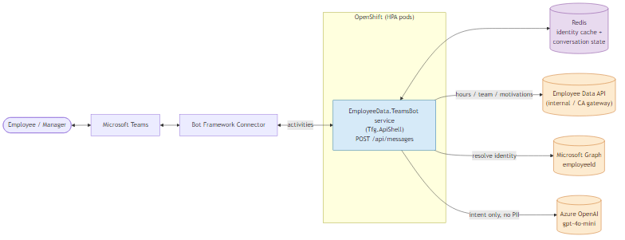
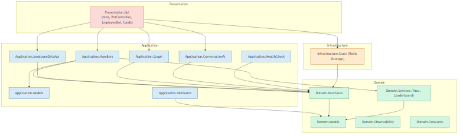
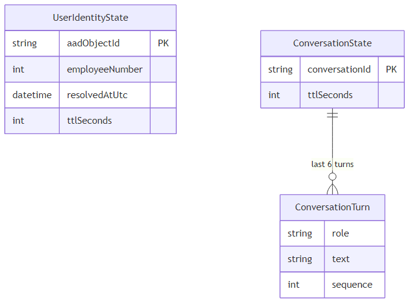
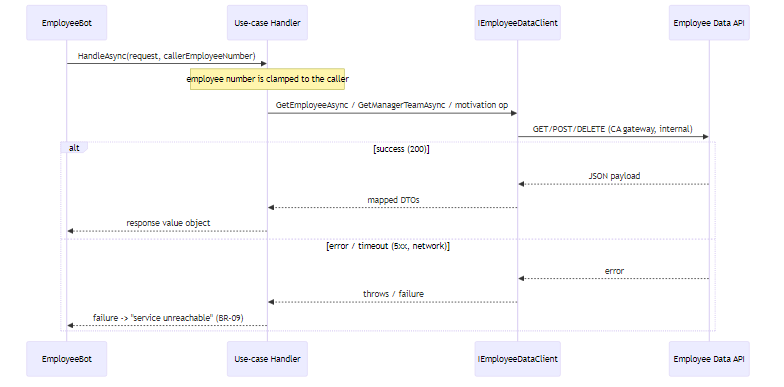
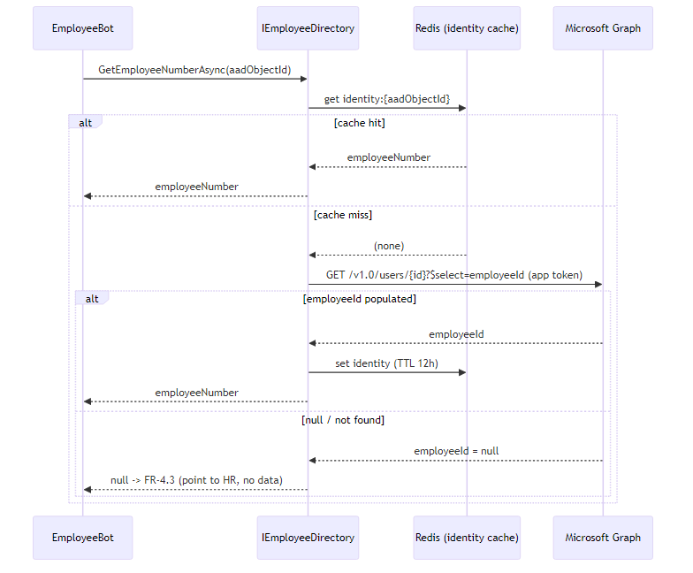
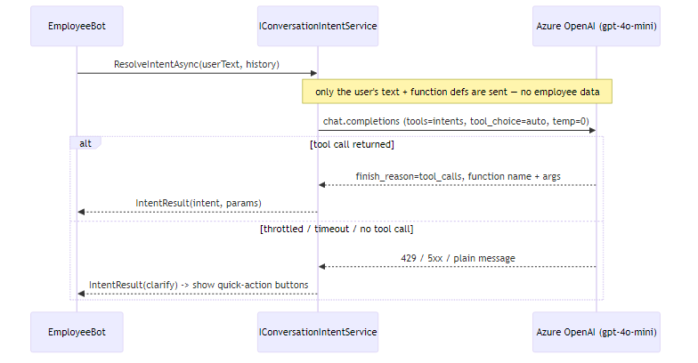
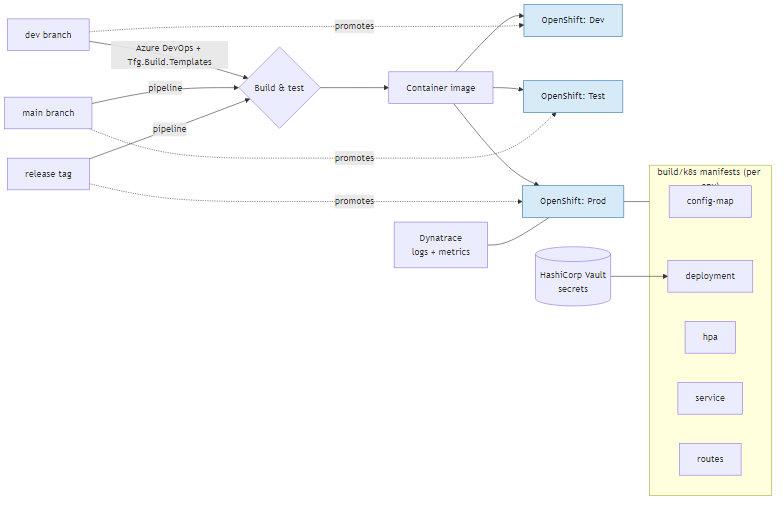

# Technical Specification: In-Office Hours Assistant

---

## 1. 📋 Document Control

| Field | Value |
|-------|-------|
| **Version** | 1.1.3 |
| **Status** | ✅ APPROVED |
| **Product Spec Version** | 1.1.0 |
| **Created** | 2026-06-30 |
| **Last Modified** | 2026-07-01 |
| **Author(s)** | SibusisoSik |

### 📝 Changelog

| Version | Date | Changes | Changed By |
|---------|------|---------|------------|
| 1.0.0 | 2026-06-30 | Initial assembled technical spec | SibusisoSik |
| 1.1.0 | 2026-07-01 | Adversarial review pass: added TC-07 (ApiShell↔Bot Framework hosting) + TA-07/TR-09/TOQ-05 + CP-08 fallback; specified custom Redis `IStorage` (ETag) + TR-10; code-side month resolution; AddMotivation BR-05 pre-check; remove-motivation selector→id flow; glossary gaps closed. Chain reverted to DRAFT and re-approved. | SibusisoSik |
| 1.1.1 | 2026-07-01 | TOQ-05 spike (inspection): confirmed ApiShell's AutoWrapper + Vault-at-startup conflict; **CP-08 (plain host) elevated to the recommended host approach**; TR-09 mitigated; TOQ-05 narrowed to a dev/CI runtime confirm. Patch (selects a documented option). | SibusisoSik |
| 1.1.2 | 2026-07-01 | IT cannot provision Azure OpenAI in-tenant or change the OpenShift workload-identity auth. Pivot: dev self-provisions Azure OpenAI in the **VS Prof Subscription** (TFG work account ⇒ still in-tenant); auth is **API key via Vault** (managed identity dropped); added TR-11 (prod LLM hosting unresolved, dev on capped R&D credit); TOQ-01 resolved for dev / prod deferred; TA-04 partially validated. Patch. | SibusisoSik |
| 1.1.3 | 2026-07-01 | Dev deployment provisioned, resolving TOQ-01 for real: resource `aoai-teamsbot-aue` (**Australia East**), deployment name **`gpt-5.4-mini`**, **Data Zone Standard**, 100K TPM, **v1 Responses API** endpoint. The GPT-4-era mini models (`gpt-4o-mini`/`gpt-4.1-mini`) are deprecated and undeployable in the current Foundry, so the cheap intent model moved to `gpt-5.4-mini` (same low-cost tier). Corrected §13.3 request contract for GPT-5 param rules (drop `temperature:0` → default only; `max_tokens` → `max_completion_tokens`). Config default (§15), EC-06, TA-04, TR-02 updated accordingly. Patch. | SibusisoSik |

### ✅ Approval Record

| Version | Status | Approved By | Role | Approval Date |
|---------|--------|-------------|------|---------------|
| 1.0.0 | ✅ APPROVED | SibusisoSik | Engineering Lead | 2026-06-30 |
| 1.1.0 | ✅ APPROVED | SibusisoSik | Engineering Lead | 2026-07-01 |
| 1.1.1 | ✅ APPROVED | SibusisoSik | Engineering Lead | 2026-07-01 |
| 1.1.2 | ✅ APPROVED | SibusisoSik | Engineering Lead | 2026-07-01 |
| 1.1.3 | ✅ APPROVED | SibusisoSik | Engineering Lead | 2026-07-01 |

### 🗂️ Sub-spec sign-off ledger

| Sub-spec | File | Version | Approved By | Role | Approval Date |
|----------|------|---------|-------------|------|---------------|
| Technical Challenges | `technical-challenges.md` | 1.1.0 | SibusisoSik | Engineering Lead | 2026-07-01 |
| Architecture | `architecture.md` | 1.1.1 | SibusisoSik | Engineering Lead | 2026-07-01 |
| Data & Contracts | `data-and-contracts.md` | 1.1.1 | SibusisoSik | Engineering Lead | 2026-07-01 |
| Technical Risks | `technical-risks.md` | 1.1.1 | SibusisoSik | Engineering Lead | 2026-07-01 |

---

## 2. 📖 Glossary of Terms & Abbreviations

| Abbreviation / Term | Full Form | Definition |
|---------------------|-----------|------------|
| Bot Framework | Microsoft Bot Framework | SDK + Azure Bot service that connects a bot to channels such as Teams |
| Bot Connector | — | The Bot Framework service that relays activities between Teams and the bot's `/api/messages` |
| Activity | — | A Bot Framework message object (inbound user message or outbound bot reply) |
| Adaptive Card | — | A JSON-defined rich card rendered natively in Teams |
| NLU | Natural Language Understanding | Interpreting free-form text into an intent + parameters |
| Intent | — | The classified action a user's message maps to (e.g. `get_my_hours`) |
| Function/tool calling | — | An LLM feature where the model returns a structured call to a named function |
| Azure OpenAI | — | Microsoft's in-tenant hosting of OpenAI models |
| `gpt-5.4-mini` | — | The small, cheap chat model used for intent classification (superseded `gpt-4o-mini`, which is deprecated/undeployable in the current Foundry) |
| Graph | Microsoft Graph | Microsoft's API for Entra/M365 data, used here to read `employeeId` |
| `employeeId` | — | An Entra user attribute holding the TFG employee number |
| Entra | Microsoft Entra ID | Microsoft's identity provider (formerly Azure AD) |
| `IStorage` | — | Bot Framework's pluggable state-storage interface |
| Redis | — | In-memory key-value store used as the distributed state backend |
| HPA | Horizontal Pod Autoscaler | OpenShift/Kubernetes component that scales pod count by load |
| OpenShift | — | Red Hat's Kubernetes platform; the deployment target |
| CA gateway | — | The TFG API gateway that fronts internal APIs and handles auth |
| Vault | HashiCorp Vault | The team's secrets manager |
| Polly | — | .NET resilience library (timeouts, retries, circuit breakers) |
| ApiShell | `Tfg.ApiShell` | The team's standard ASP.NET Core host bootstrap |
| Dynatrace | — | The observability platform that scrapes logs + metrics |
| CloudAdapter | — | The Bot Framework component that receives/sends activities over HTTP |
| JWT | JSON Web Token | Signed token the Bot Connector presents to authenticate calls to `/api/messages` |
| HA | High Availability | Redundant deployment so a component survives a single failure |
| xUnit | — | .NET unit-testing framework |
| WireMock | — | HTTP mock server used to stub external APIs in integration tests |
| NBomber / k6 | — | Load-testing tools used to validate latency (NFR-1) |
| URL | Uniform Resource Locator | A web address (e.g. an API base URL) |
| DI | Dependency Injection | Supplying dependencies via constructor injection |
| CQRS | Command Query Responsibility Segregation | Separate command/query handlers; here without a separate read store |
| SOLID | — | The five OO design principles (non-negotiable team standard) |
| Clean Architecture | — | Layered architecture with inward-only dependencies |
| Clamp | — | Overriding a model-supplied parameter with the authenticated caller's value |
| Handler | — | A class implementing one use case (`IRequestHandler<TRequest,TResponse>`) |
| Correlation id | — | An id threaded through logs/calls to trace one request end-to-end |
| p95 | 95th percentile | The latency 95% of requests are at or below |
| TTL | Time To Live | How long a cached value is retained before expiry |
| T-1 | — | Data current through the previous day |
| ERD | Entity Relationship Diagram | A diagram of data entities and their relationships |
| PII | Personally Identifiable Information | Data identifying an individual |
| TLS | Transport Layer Security | Encryption of data in transit |
| MTD | Month-to-date | Hours accumulated so far this calendar month |
| FR / NFR / BR | Functional / Non-Functional Requirement / Business Rule | Product-spec requirement references |
| TC / EC / CP / AP / KA / TA / TR / OQ | — | Technical-spec ids: Challenge / Constraint / Candidate Pattern / Architectural Pattern / Key Abstraction / Technical Assumption / Technical Risk / Open Question |

---

## 3. 📊 Executive Summary

The In-Office Hours Assistant is a single stateless ASP.NET Core service (.NET 10, a plain minimal host that
reuses `Tfg.ApiShell` for config/observability/health — see TOQ-05/CP-08) that implements a Microsoft Teams
bot, deployed as HPA-scaled pods on OpenShift. Per turn it resolves the Teams
user to an employee number via Microsoft Graph `employeeId` (cached in Redis), classifies the request into one
of ~10 intents using Azure OpenAI `gpt-5.4-mini` (function calling, sent only the user's text — never employee
data), dispatches to a direct-DI use-case handler that reads/writes the existing **Employee Data API**, computes
pace/at-risk and the anonymised leaderboard in pure domain logic, and renders the result as an Adaptive Card or
text. It follows Clean Architecture (no relational database, so no Repository/Unit-of-Work), enforces all
privacy bot-side via a parameter clamp, and degrades gracefully when any of its four external dependencies
(Employee Data API, Graph, Azure OpenAI, Redis) is unavailable. The most consequential decisions: a cheap
in-tenant LLM used for intent only (keeping PII out of the model), Redis-backed Bot Framework state for
multi-pod operation, and the bot acting as the sole access-control layer while the backend API auth is disabled.

---

## 4. 🏗️ Architecture Overview

### Core Technical Challenges

| # | Challenge | Why it is hard | Where the risk lives | Product Spec Ref |
|---|----------|---------------|---------------------|-----------------|
| TC-01 | Resolve a Teams user → employee number + role | No employee number in the activity; depends on Graph `employeeId`; role derived without an org-chart service | Identity resolver; Graph data quality | FR-4.1, FR-4.3, AC-2 |
| TC-02 | Compute pace / at-risk / leaderboard bot-side | Working-day maths, early-month guard, merging the caller's figure into masked peers | Domain pace/leaderboard logic | FR-1.1, FR-1.3, FR-3.1, FR-3.3, BR-01, BR-02 |
| TC-03 | Enforce privacy bot-side while API auth is disabled | The bot is the only gate; delete-by-id has no server-side ownership check | Tool dispatcher clamp | NFR-4, BR-08, AC-6 |
| TC-04 | Cheap in-tenant NLU within latency, no PII leak | Interpret free text + route in ≤8s p95, keep data out of the model | Conversation/intent service | FR-4.2, NFR-1, NFR-4 |
| TC-05 | State across HPA-scaled, affinity-less pods | Turns can land on different pods; in-memory state splits | Distributed state store | NFR-2, NFR-5 |
| TC-06 | Degrade gracefully on external outages | 4 externals can each fail; never show raw errors/stale data | Resilience layer | BR-09, NFR-2 |
| TC-07 | Host a Bot Framework adapter inside the REST-oriented `Tfg.ApiShell` | ApiShell's header/auth/health middleware can conflict with the Bot Connector's own JWT auth + raw body on `/api/messages` | Host composition | NFR-2, FR-4.1 |

### Engineering Constraints

| # | Constraint | Source | Implication |
|---|-----------|--------|-------------|
| EC-01 | SOLID + Clean Architecture; direct-DI handlers, no MediatR | `/architectural-patterns` | Layered modules, inward deps, handler-per-use-case |
| EC-02 | No relational database | This solution | No Repository/Unit-of-Work; only transient Redis state |
| EC-03 | Mirror the `Tfg.HrSystems.EmployeeDiscountManagementSystem` structure | User directive | Feature-sliced projects; standard scaffold; clients under `Application.{Concern}` |
| EC-04 | Host via `Tfg.ApiShell`; Vault secrets; OpenShift + Azure DevOps; Dynatrace | Reference + team standard | ApiShell hook composition + observability |
| EC-05 | Employee Data API auth disabled; internal-only + CA gateway | AC-6 / TD-11 | Bot is the access layer; CA-gateway auth on outbound calls |
| EC-06 | LLM must be in-tenant (no public LLM) | POPIA / NFR-4 | Azure OpenAI `gpt-5.4-mini` (Data Zone Standard keeps data in-geography), intent-only prompts |
| EC-07 | Teams + Bot Framework; tenant-admin app registration | D-1 | Azure Bot + Teams manifest; IT approval (R-7) |

### System Overview

A single stateless ASP.NET Core service implements the Teams bot. The Bot Framework Connector delivers Teams
activities to `POST /api/messages`. Each turn: resolve identity (Graph, cached in Redis) → classify intent
(Azure OpenAI) → dispatch to a use-case handler (clamped to the caller) → read/write the Employee Data API →
compute pace/leaderboard in `Domain.Services` → render an Adaptive Card or text. Shared state (identity cache +
recent conversation) lives in Redis. No relational database.

*Source: `diagrams/architecture/overview.mmd`*

---

## 5. 🔑 Key Abstractions

| # | Abstraction | Purpose | Operations | Owner module |
|---|------------|---------|------------|--------------|
| KA-01 | `IEmployeeDirectory` | Teams user → employee number | `Task<int?> GetEmployeeNumberAsync(string aadObjectId, CancellationToken ct)` | Domain.Interfaces |
| KA-02 | `IEmployeeDataClient` | All Employee Data API access | `GetEmployeeAsync(int)`, `GetManagerTeamAsync(int, int)`, `GetMotivationsAsync(int, int)`, `AddMotivationAsync(AddMotivationRequest)`, `DeleteMotivationAsync(int)`, `GetMotivationTypesAsync()` | Domain.Interfaces |
| KA-03 | `IConversationIntentService` | Classify message → intent + params (no PII sent) | `Task<IntentResult> ResolveIntentAsync(string userText, IReadOnlyList<ConversationTurn> history, CancellationToken ct)` | Domain.Interfaces |
| KA-04 | `IPaceCalculator` | Working-day pace + at-risk | `PaceStatus Evaluate(int mtdHours, DateOnly asAt)` | Domain.Interfaces |
| KA-05 | `ILeaderboardBuilder` | Merge caller's figure into masked peers, rank | `Leaderboard Build(EmployeeStanding self, IReadOnlyList<LeaderboardRow> maskedPeers)` | Domain.Interfaces |
| KA-06 | `IBotStateStore` | Identity cache + conversation context | `GetIdentityAsync`, `SetIdentityAsync`, `GetConversationAsync`, `AppendTurnAsync` | Domain.Interfaces |
| KA-07 | `IRequestHandler<TRequest,TResponse>` | One per use case (10 handlers) | `Task<TResponse> HandleAsync(TRequest, CancellationToken)` | Application.Handlers |

---

## 6. 🧱 Architectural Patterns

| # | Pattern | Applies To | Justification | Product Spec Ref |
|---|--------|-----------|--------------|-----------------|
| AP-01 | Clean Architecture | Whole solution | Team non-negotiable; isolates testable domain logic | NFR-4, FR-1.1 |
| AP-02 | Direct-DI handler per use case (no MediatR) | Application | Team idiom; testable; no DB ⇒ no Repository/UoW | FR-1.x, FR-2.x, FR-3.x |
| AP-03 | Adapter/Gateway behind ports | 3 externals | Swappable + fakes + single resilience point | FR-4.1, BR-09 |
| AP-04 | Bot Framework `IStorage` over Redis | State | Shared state across HPA pods | NFR-2, NFR-5 |
| AP-05 | Security clamp in the dispatcher | Tool dispatch | Caller number overrides model value; delete ownership-checked | NFR-4, BR-08 |
| AP-06 | Resilience (Polly) | Outbound clients | Bounded latency; graceful failure | NFR-1, BR-09 |
| AP-07 | Observability (logs/metrics/correlation id) | Whole solution | Team non-negotiable | NFR-2 |

---

## 7. 🛠️ Tech Stack

| Layer | Technology | Rationale | Standard Compliant |
|-------|-----------|-----------|-------------------|
| Language / runtime | C# / .NET 10 | Matches backend + portfolio | Yes |
| Host | **Plain ASP.NET Core minimal host (CP-08)** + `Tfg.ApiShell` for config/observability/health only | TOQ-05 found ApiShell bundles `AutoWrapper.Core` (wraps responses, breaks the Bot Connector) + Vault-at-startup; a plain host runs `CloudAdapter` + `/api/messages` (`BotFrameworkAuthentication`) with no AutoWrapper. Runtime confirm in dev/CI (TR-09/TOQ-05) | Deviation: documented (CP-08) |
| Bot | Microsoft.Bot.Builder (CloudAdapter, ActivityHandler) | Teams plumbing | Yes |
| NLU | Azure OpenAI `gpt-5.4-mini` (`Azure.AI.OpenAI`) | In-tenant, cheap, intent-only | Deviation: first LLM use — documented (TD-13) |
| UI | Adaptive Cards | Structured Teams views | Yes |
| State | **Custom** `RedisStorage : IStorage` over StackExchange.Redis (ETag optimistic concurrency) | Multi-pod state; BF ships no Redis provider so we implement `IStorage` | Deviation: custom provider + reference uses `Tfg.Cache.InMemory` — documented (TD-7) |
| Resilience | Polly | Timeouts/retries/breakers | Yes |
| Secrets | HashiCorp Vault | Team convention | Yes |
| Deploy | OpenShift + Azure DevOps `Tfg.Build.Templates` | Team convention | Yes |
| Observability | Dynatrace + correlation ids | Team convention | Yes |

---

## 8. 📦 Module Structure & Dependencies

### Module list

| Module | Layer | Responsibility |
|--------|-------|---------------|
| `EmployeeData.TeamsBot.Domain.Models` | Domain | Value objects (`PaceStatus`, `MonthHours`, `EmployeeStanding`, `Leaderboard`, `TeamMemberStanding`, `MotivationView`, `MotivationType`, `CallerRole`) |
| `EmployeeData.TeamsBot.Domain.Interfaces` | Domain | Ports KA-01…KA-06 |
| `EmployeeData.TeamsBot.Domain.Services` | Domain | `PaceCalculator`, `LeaderboardBuilder`, `WorkingDayCalendar` |
| `EmployeeData.TeamsBot.Domain.Observability` | Domain | Metric names + log constants |
| `EmployeeData.TeamsBot.Domain.Constants` | Domain | Goal hours, thresholds, intent names |
| `EmployeeData.TeamsBot.Application.Handlers` | Application | 10 direct-DI use-case handlers |
| `EmployeeData.TeamsBot.Application.Models` | Application | Request/response DTOs; `IntentResult` |
| `EmployeeData.TeamsBot.Application.Validators` | Application | Month format, type id, qualifying month |
| `EmployeeData.TeamsBot.Application.HealthCheck` | Application | Health contributors |
| `EmployeeData.TeamsBot.Application.EmployeeDataApi` | Application | Typed `HttpClient` + DTOs |
| `EmployeeData.TeamsBot.Application.Graph` | Application | Graph directory client |
| `EmployeeData.TeamsBot.Application.ConversationAi` | Application | Azure OpenAI client + function defs |
| `EmployeeData.TeamsBot.Infrastructure.State` | Infrastructure | Redis `IStorage` + `IBotStateStore` |
| `EmployeeData.TeamsBot.Presentation.Bot` | Presentation | Host, `BotController`, `EmployeeBot`, `Cards/`, `Dependencies/*` |
| `EmployeeData.TeamsBot.Tests` | Test | Unit + integration tests |

### Dependency graph

| Module | Depends On | Must NOT Depend On |
|--------|-----------|-------------------|
| `Domain.*` | nothing outside Domain | Application, Infrastructure, Presentation, any SDK |
| `Application.Handlers` | Domain.Interfaces/Models/Services, Application.Models | Infrastructure, Presentation |
| `Application.{EmployeeDataApi,Graph,ConversationAi}` | Domain.Interfaces/Models, Application.Models | Presentation; each other |
| `Application.{Validators,Models,HealthCheck}` | Domain.* | Infrastructure, Presentation |
| `Infrastructure.State` | Domain.Interfaces/Models | Application.Handlers, Presentation |
| `Presentation.Bot` | Application.*, Infrastructure.* (composition root only), Domain.* | — |

*Source: `diagrams/architecture/modules.mmd`*

### Service registration strategy

Composition root is `Presentation.Bot`. Per TOQ-05, `Program.cs` builds a **plain `WebApplication`** (CP-08),
reusing ApiShell's config/observability/health components as libraries (no AutoWrapper over `/api/messages`).
Registration uses per-concern extension methods — `AddBotAdapter()`, `AddConversationAi(config)`,
`AddEmployeeDataApi(config)` (typed `HttpClient` + Polly + CA-gateway handler), `AddGraphDirectory(config)`,
`AddBotState(config)` (the **custom** `RedisStorage : IStorage`, `UserState`, `ConversationState`,
`IBotStateStore`), `AddBotAdapter()` (`CloudAdapter` + `BotFrameworkAuthentication`; `/api/messages` mapped
**outside** ApiShell's auth/header middleware — TC-07, spike TOQ-05, fallback CP-08), `AddDomainServices()`,
`AddHandlers()` (every `IRequestHandler<,>`, scoped, **no MediatR**), `AddValidators()`, `AddHealthChecks()`,
`AddObservability()`. Lifetimes: clients/handlers scoped; `IStorage`, Azure OpenAI client, and configuration
singleton; Graph token cached with refresh.

---

## 9. 💾 Data Models

No relational database; the only persisted data is transient Redis state. The ERD shows the two state entities;
all other models are in-memory value objects mapped from API responses.

*Source: `diagrams/data/erd.mmd`*

| Entity | Type | Purpose | Product Spec Ref |
|--------|------|---------|-----------------|
| `UserIdentityState` | Redis `identity:{aadObjectId}` | `EmployeeNumber` + `ResolvedAtUtc`, TTL 12h | FR-4.1 |
| `ConversationState` | Redis `conv:{conversationId}` | Last 6 `ConversationTurn` (role+text); no employee data | FR-4.2 |
| `EmployeeStanding`, `MonthHours`, `Leaderboard`, `TeamMemberStanding`, `MotivationView`, `MotivationType` | Value objects | Mapped from API responses; rendered, not persisted | FR-1.x, FR-2.x, FR-3.x |
| `PaceStatus` (`OnTrack`/`Behind`/`AtRisk`/`TooEarly`), `CallerRole` (`Employee`/`Manager`) | Enums | Pace + role | BR-01, BR-02, FR-4.1 |

---

## 10. ⏳ Data Lifecycle

| Stage | Trigger | Action | Retention | Owner |
|-------|---------|--------|-----------|-------|
| Identity resolve | Cache miss | Graph lookup → write `UserIdentityState` | TTL 12h | `IBotStateStore` |
| Conversation append | Each turn | Append turn, trim to last 6 | Sliding TTL 30 min | `IBotStateStore` |
| Hours/team/motivation reads | Per request | Fetch live → map → render, not persisted | Request-scoped | Handlers |
| Motivation write/delete | Confirmed user action | POST/DELETE to API | None bot-side (API is system of record) | Handlers |

---

## 11. 🧩 Handler Contracts

| Handler | Input Contract | Output Contract | Entry Point | Product Spec Ref |
|---------|---------------|-----------------|-------------|-----------------|
| `GetMyHoursHandler` | `GetMyHoursRequest(int EmployeeNumber)` | `EmployeeStanding` | Bot message | FR-1.1 |
| `GetMyHistoryHandler` | `GetMyHistoryRequest(int EmployeeNumber)` | `IReadOnlyList<MonthHours>` (≤6) | Bot message | FR-1.2 |
| `GetPeerStandingHandler` | `GetPeerStandingRequest(int EmployeeNumber)` | `Leaderboard` | Bot message | FR-1.3 |
| `ListMotivationsHandler` | `ListMotivationsRequest(int EmployeeNumber, int? TargetEmployeeNumber, int LastXMonths=6)` | `IReadOnlyList<MotivationView>` | Bot message | FR-2.2 |
| `GetMotivationTypesHandler` | `GetMotivationTypesRequest()` | `IReadOnlyList<MotivationType>` | Bot message | FR-2.1, BR-07 |
| `AddMotivationHandler` | `AddMotivationRequest(int EmployeeNumber, int TargetEmployeeNumber, int MotivationTypeId, string CalendarMonth, string Description)` | `AddMotivationResult(int Id, bool Updated)` | Bot message | FR-2.1, BR-05/06 |
| `RemoveMotivationHandler` | `RemoveMotivationRequest(int EmployeeNumber, int MotivationId)` | `RemoveMotivationResult(bool Deleted)` | Bot message | FR-2.3 |
| `GetTeamThisMonthHandler` | `GetTeamThisMonthRequest(int ManagerEmployeeNumber)` | `IReadOnlyList<TeamMemberStanding>` | Bot message | FR-3.1 |
| `GetTeamHistoryHandler` | `GetTeamHistoryRequest(int ManagerEmployeeNumber, int Months=6)` | `IReadOnlyList<TeamMemberStanding>` | Bot message | FR-3.2 |
| `GetAtRiskHandler` | `GetAtRiskRequest(int ManagerEmployeeNumber)` | `IReadOnlyList<TeamMemberStanding>` (sorted by shortfall) | Bot message | FR-3.3 |

> Clamp rules per `data-and-contracts.md` §Handler Contracts: caller number is authoritative; manager-team
> membership bounds any `TargetEmployeeNumber`; `RemoveMotivation` ownership-checks the id first (BR-08).
>
> **Dispatcher pre-processing (code-side, not the LLM):** `monthPhrase` → `CalendarMonth` (`YYYYMM`) via the
> current date; `motivationType` → `MotivationTypeId` (BR-07); `targetEmployeeName` → a report's number within
> the caller's team; `selector` → a concrete `MotivationId` via list-and-match, else a per-row "Remove" button.
> **`AddMotivationHandler` enforces BR-05** by reading the subject's hours for `CalendarMonth` and declining
> met-goal months *before* POST (not just reacting to a `400`). See `data-and-contracts.md` §Handler Contracts.

---

## 12. 📨 Internal Events & Messages

Not applicable — the bot has no internal event bus or message broker; each turn is a synchronous
request/response and components communicate by direct method calls behind Domain ports.

---

## 13. 🌐 API & Integration Contracts

> Full standalone wire examples, enumeration tables, and the per-endpoint request/response blocks are in
> `data-and-contracts.md` §13 (Employee Data API, Microsoft Graph, Azure OpenAI, Bot Connector). Summary +
> diagrams below; reference tables in §22.

### 13.1 Employee Data API — REST/JSON

Base URL `https://tst-tfg-hrsystems-employeedata-api.apps.ocptst.ho.fosltd.co.za` (test). Endpoints used:
`GET /api/employee`, `GET /api/managerteam`, `GET|POST /api/motivation`, `DELETE /api/motivation/{id}`,
`GET /api/motivationtype`. Raw JSON (no envelope). Complete examples in `data-and-contracts.md` §13.1.

*Source: `diagrams/api/employee-data-api.mmd`*

### 13.2 Microsoft Graph — REST

`GET /v1.0/users/{aadObjectId}?$select=employeeId`, app token via client credentials. Example in §13.2.

*Source: `diagrams/api/graph.mmd`*

### 13.3 Azure OpenAI — Chat Completions (function calling)

`gpt-5.4-mini`, `tool_choice=auto`; only the user's text + function defs are sent. **GPT-5-series param rules:**
omit `temperature` (only the default is accepted) and use `max_completion_tokens` (not `max_tokens`). The dev
deployment exposes the **v1 Responses API** surface (`…/openai/v1/responses`); the `Azure.AI.OpenAI` client is
configured for the resource endpoint accordingly. Intent function table in §22.1; complete request/response in
§13.3 of `data-and-contracts.md`.

*Source: `diagrams/api/azure-openai.mmd`*

### 13.4 Bot Framework — `POST /api/messages`

Inbound/outbound `Activity`; Adaptive Card attachments for structured views; `Action.Submit` button taps carry
`data.intent` and bypass the LLM. No business REST surface ⇒ team response envelope N/A. Examples in §13.4.

---

## 14. 🚀 Infrastructure & Deployment

| Environment | Platform | Configuration |
|-------------|----------|--------------|
| Dev | OpenShift (`ocptst` cluster namespace) | From `dev` branch; lowest resources; test Employee Data API |
| Test | OpenShift | From `main` branch; integration target |
| Prod | OpenShift | From release tag; CA-gateway to the internal Employee Data API; HPA enabled |

Pipeline: Azure DevOps using shared `Tfg.Build.Templates`; branch→environment by convention (dev→Dev,
main→Test, tag→Prod); build → unit/integration tests (gate) → container image → deploy via `build/k8s`
manifests (`config-map`, `deployment`, `hpa`, `service`, `routes`). Rollback = redeploy the previous image tag
/ unpublish the Teams app version. Bot-specific: an **Azure Bot** resource (messaging endpoint → the prod route)
and the **Teams app manifest** (`bots` scope `personal`), sideloaded/published with tenant-admin approval.

*Source: `diagrams/deployment/pipeline.mmd`*

---

## 15. ⚙️ Configuration Schema

| Key | Type | Source | Default | Required | Notes |
|-----|------|--------|---------|----------|-------|
| `Bot:MicrosoftAppId` | string | Vault | — | Yes | Azure Bot app id |
| `Bot:MicrosoftAppPassword` | string (secret) | Vault | — | Yes | Bot app password |
| `Bot:TenantId` | string | appsettings | — | Yes | Single-tenant bot |
| `AzureOpenAI:Endpoint` | string (URL) | appsettings | — | Yes | In-tenant resource endpoint. Dev: `https://aoai-teamsbot-aue.services.ai.azure.com` (v1 Responses API surface `…/openai/v1/responses`) |
| `AzureOpenAI:ApiKey` | string (secret) | Vault (prod) / user-secrets (dev) | — | Yes | API key only; managed identity not available — OpenShift workload-identity is frozen (TR-11) |
| `AzureOpenAI:Deployment` | string | appsettings | `gpt-5.4-mini` | Yes | Deployment name (TOQ-01 resolved: `gpt-5.4-mini`, Data Zone Standard, Australia East) |
| `Graph:TenantId` | string | appsettings | — | Yes | Entra tenant |
| `Graph:ClientId` | string | appsettings | — | Yes | App registration |
| `Graph:ClientSecret` | string (secret) | Vault | — | Yes | Client credentials |
| `EmployeeApi:BaseUrl` | string (URL) | appsettings (per env) | — | Yes | Employee Data API |
| `EmployeeApi:GatewayAuth` | object (secret) | Vault | — | Prod | CA-gateway credential (TOQ-02) |
| `Redis:ConnectionString` | string (secret) | Vault | — | Yes | State store (TOQ-03) |
| `Pace:MonthlyGoalHours` | int | appsettings | `100` | No | Goal constant (AC-5; eases v2 pro-rating) |
| `Pace:EarlyMonthThresholdPercent` | int | appsettings | `30` | No | Early-month guard (BR-02) |
| `Identity:CacheTtlHours` | int | appsettings | `12` | No | Identity cache TTL |
| `Conversation:TtlMinutes` | int | appsettings | `30` | No | Conversation TTL |
| `Conversation:MaxTurns` | int | appsettings | `6` | No | History window |

---

## 16. ⚡ Error Handling & Failure Modes

| Scenario | Detection | Response | User Impact | Recovery |
|----------|-----------|----------|-------------|----------|
| Employee Data API down | Timeout/`5xx`/network | "Hours service unreachable — try again shortly" (BR-09) | No data this turn | Polly retry+breaker; next ask |
| Employee Data API `400` (motivation) | `400` | Friendly correction (e.g. month met goal — BR-05) | Write declined | User corrects |
| Graph down / `employeeId` null | Token/`5xx`/null | Cached identity if present; else FR-4.3 (point to HR) | Possibly blocked | Use cache; re-resolve next turn |
| Azure OpenAI throttle/timeout (`429`/`5xx`) | HTTP status/timeout | Quick-action buttons + "pick an option" | Degraded NLU; buttons work | Backoff retry; buttons bypass LLM |
| Redis down | Connection error | Stateless: re-resolve identity, reset context | Lost follow-up context | Reconnect; re-cache next turn |
| Bot Connector send fails | Send error | Log + correlation id | Reply may not arrive | SDK retry; user re-asks |
| Clamp violation attempt | Target not in caller's set | Refuse + neutral message | None (blocked) | n/a (by design) |

---

## 17. 📡 Observability

| Signal | Mechanism | What Is Measured | Alert Threshold |
|--------|-----------|-----------------|-----------------|
| Request rate + latency | Metric (histogram) per intent | Throughput; turn latency | p95 > 8s (5-min window) → page |
| Outbound call latency/errors | Metric per dependency (EDA/Graph/AOAI/Redis) | Dependency health | error rate > 5% (5-min) → page |
| Identity resolution | Counter (success/fail/unmapped) | Mapping health (TA-01) | unmapped rate > 10% → investigate |
| Intent outcome | Counter (per intent / clarify / fallback) | NLU quality | clarify+fallback > 25% → investigate |
| Clamp refusals | Counter | Attempted cross-employee access | any sustained spike → security review |
| AOAI throttling | Counter (`429`) | Capacity | `429` rate > 1% → capacity review |
| Liveness/readiness | `/healthz` (ApiShell) | Pod health; Redis/EDA reachability | readiness fail → pod recycle |

All structured logs go to stdout (scraped by Dynatrace); counters exposed on `/metrics`; a correlation id is
derived per inbound activity and threaded through logs and outbound calls (AP-07).

---

## 18. 🔐 Security & Compliance

### Authentication & Authorisation

| Entry Point | Mechanism | Authorisation Model |
|-------------|-----------|---------------------|
| `POST /api/messages` (inbound) | Bot Framework JWT from the Connector, validated by `BotFrameworkAuthentication` | Channel-authenticated; user identity from `Activity.From.AadObjectId` |
| → Microsoft Graph (outbound) | Client-credentials app token (`User.Read.All`) | App-only; least-privilege select of `employeeId` |
| → Employee Data API (outbound) | CA-gateway auth (prod); none in test (auth disabled) | Bot enforces user scope via the clamp (AP-05); never trusts model params |
| → Azure OpenAI (outbound) | API key (Vault; user-secrets in dev) | In-tenant; intent-only payloads (no PII) |

### Secrets Management

All secrets (bot password, Graph client secret, Azure OpenAI key, Redis connection, CA-gateway credential) are
stored in **HashiCorp Vault** and surfaced through the `Tfg.ApiShell` configuration pipeline; non-secret config
in per-environment `appsettings.{Env}.json`. Nothing secret is committed.

### Regulatory Compliance

| Product Spec Ref (RC) | Technical Approach |
|-----------------------|--------------------|
| RC-01 (POPIA good practice) | Role-based access enforced bot-side (clamp + manager-team scoping); peer masking preserved; TLS on all hops; **no employee PII sent to the LLM** (intent-only, TD-14); in-tenant Azure OpenAI; identity/conversation state TTL'd in Redis and never includes hours data |

### Threats considered

Cross-employee data access (mitigated by the clamp + delete ownership check, TR-03); PII exfiltration to the
model (intent-only design + log redaction, TR-06); spoofed identity (identity comes from the Connector-validated
activity, not user input); secrets exposure (Vault); direct API access bypassing the bot (internal-only + CA
gateway, TD-11/R-3).

---

## 19. 🧪 Testing Strategy

| Level | Scope | Tooling | Coverage Target | Owner |
|-------|-------|---------|-----------------|-------|
| Unit | `Domain.Services` (pace/leaderboard/working-day), validators, clamp logic | xUnit | ≥90% of Domain | Eng |
| Integration | Handlers with faked clients; `IEmployeeDataClient` against recorded API contracts; intent service with recorded AOAI responses | xUnit + WireMock/test doubles | All 10 handlers + failure paths | Eng |
| End-to-end | Bot turn via the Bot Framework test adapter (message → intent → handler → card) | Bot Framework `TestAdapter` | The 5 product TS scenarios | QA |
| Performance | Turn latency under load (LLM + API round-trips) | k6 / NBomber | Validate NFR-1 ≤8s p95 | Eng |

### Test Environment Configuration

Externals are substituted with test doubles: a faked `IEmployeeDataClient` (and WireMock for the HTTP layer), a
faked `IConversationIntentService` (or recorded AOAI responses), a faked `IEmployeeDirectory`, and an in-memory
`IStorage` in place of Redis. No real Teams/Graph/AOAI/Redis needed for unit+integration. `EnvironmentHelper`
test mode (per the reference) selects the doubles. The Bot Framework `TestAdapter` drives end-to-end turns.

### Product Spec Scenario Coverage

| Scenario (TS) | Technical Approach | Automated |
|---------------|--------------------|-----------|
| TS-01 (pace calc mid-month) | Unit tests over `PaceCalculator` with seeded MTD + dates incl. early-month + holiday-adjacent | Yes |
| TS-02 (leaderboard merge) | Unit test over `LeaderboardBuilder` (own figure merged + ranked, "you") | Yes |
| TS-03 (motivation upsert) | Integration: add same type+month twice → second updates; confirm prompt | Yes |
| TS-04 (role gating) | Integration: employee invokes a team intent → declined; clamp refusal counter increments | Yes |
| TS-05 (backend failure) | Integration: API double returns `5xx` → "service unreachable" (BR-09) | Yes |

---

## 20. ⚠️ Technical Risks & Assumptions

### Technical Assumptions

| # | Description | Impact if wrong | Owner | Status |
|---|-------------|-----------------|-------|--------|
| TA-01 | Graph `employeeId` populated + matches API `employeeNumber` | Identity fails | HR Systems / IT | open |
| TA-02 | `managerteam` returns exactly the caller's direct reports (empty for non-managers) | Role gating wrong | HR Systems | validated |
| TA-03 | `timeInHoursMonthToDate` authoritative + T-1 | Pace wrong | HR Systems / data | validated |
| TA-04 | Azure OpenAI enabled with a cheap mini deployment in-tenant | No NLU | IT / Platform (prod); Eng self-provisions for dev | validated for dev (`gpt-5.4-mini` deployed in `aoai-teamsbot-aue`, Australia East, via VS Prof Subscription); prod deferred (TR-11) |
| TA-05 | Redis available in-cluster | Degraded multi-pod state | Platform | open |
| TA-06 | Employee Data API reachable internally via CA gateway in prod | No data in prod | Security / Backend | open |
| TA-07 | `Tfg.ApiShell` can host a Bot Framework adapter + `/api/messages` (or CP-08 fallback applies) | Host won't start / auth conflict | Eng | open |

### Technical Risks

| # | Risk | Likelihood | Impact | Mitigation | Owner | Status |
|---|------|-----------|--------|-----------|-------|--------|
| TR-01 | Graph `employeeId` unpopulated/mismatched | Med | High | Pre-build validation gate; config override-map fast-follow; FR-4.3 message | HR Systems / IT | open |
| TR-02 | AOAI latency/throttling vs NFR-1 | Med | Med | `gpt-5.4-mini`, low `max_completion_tokens`, timeout/backoff, typing indicator, button fallback | Eng | mitigated |
| TR-03 | Clamp/ownership bug → leak | Med | High | Centralised clamp; delete ownership check; tests (TS-04) | Eng | mitigated |
| TR-04 | Redis outage → state loss | Med | Low | Stateless re-resolve; reset context | Eng | accepted |
| TR-05 | Intent misclassification | Med | Med | Constrained schema; `clarify`; write confirmation; buttons | Eng | mitigated |
| TR-06 | PII leakage to LLM | Low | High | Intent-only design; log redaction | Eng | mitigated |
| TR-07 | Pace errors at month/holiday boundaries | Med | Med | Pure Domain unit tests; early-month guard; holidays-ignored stated (AC-1) | Eng | mitigated |
| TR-08 | Teams tenant-admin approval delays | Med | Med | Engage IT early (R-7) | IT | open |
| TR-09 | ApiShell conflicts with the Bot Connector on `/api/messages` — **confirmed** (AutoWrapper wraps responses; Vault-at-startup) | Med | High | **CP-08**: plain host runs the adapter with no AutoWrapper; ApiShell for config/observability only; runtime confirm in dev/CI (TOQ-05) | Eng | mitigated |
| TR-10 | Custom Redis `IStorage` concurrency/ETag bugs corrupt/lose state | Low | Med | Implement the BF `IStorage` contract faithfully; concurrency tests; state non-critical (TR-04) | Eng | mitigated |
| TR-11 | Prod LLM hosting unresolved (IT cannot provision Azure OpenAI in-tenant, nor change OpenShift workload-identity auth); dev runs on capped/revocable VS Prof R&D credit | High | Med | Dev/R&D spike only in the VS Prof Subscription (work account ⇒ still in-tenant) until project continuation is confirmed; API-key auth via Vault (no managed identity); revisit prod provisioning with IT if it lives on | Eng / IT | open |

### Coverage of Product-Spec Risks

| Product Spec Risk | Technical Mitigation | Owner |
|-------------------|---------------------|-------|
| R-1 | TR-01 (pre-build gate; override-map; FR-4.3) | HR Systems / IT |
| R-2 | Accepted product-side; no bot authorship | Backend / Product |
| R-3 | TD-11 internal-only + CA gateway (TA-06) + clamp (TR-03) | Security / Backend |
| R-4 | v2 pro-rating; goal is configurable (§15) | HR / Product |
| R-5 | "As at" T-1 timestamp on every hours view | Eng |
| R-6 | Non-technical (adoption) | Management |
| R-7 | TR-08 (engage IT early) | IT |

### Coverage of Product-Spec Assumptions

| Product Spec Assumption | Binds technical decision? | Mapped technical assumption | Rationale |
|-------------------------|---------------------------|----------------------------|-----------|
| AC-1 (ignore holidays) | Yes | TA-03 | `WorkingDayCalendar` Mon–Fri; configurable |
| AC-2 (identity mapping exists) | Yes | TA-01 | Identity resolver depends on it; pre-build gate |
| AC-3 (manager role derivable) | Yes | TA-02 | Role gating via `managerteam` |
| AC-4 (`timeInHoursMonthToDate` authoritative) | Yes | TA-03 | All pace maths consume it |
| AC-5 (flat 100h) | Yes | TA-03 | Goal constant in config; pro-rating v2 |
| AC-6 (API auth disabled, bot is access layer) | Yes | TA-06 | Drives clamp + internal-only network |

---

## 21. ❓ Open Questions

| # | Question | Owner | Deadline | Status |
|---|----------|-------|----------|--------|
| TOQ-01 | Azure OpenAI provisioning. **Dev: RESOLVED — resource `aoai-teamsbot-aue` in Australia East (rg `rg-teamsbot-aoai-dev`), deployment `gpt-5.4-mini`, Data Zone Standard, 100K TPM, v1 Responses API endpoint, in the VS Prof Subscription (TFG work account ⇒ in-tenant). Note: `gpt-4o-mini`/`gpt-4.1-mini` are deprecated/undeployable in the current Foundry, and Global Standard had 0 quota (Data Zone Standard had capacity). Prod: deferred — IT cannot provision in-tenant currently (TR-11).** | Eng (dev) / IT (prod) | Dev: done · Prod: TBD | dev: resolved · prod: deferred |
| TOQ-02 | CA-gateway specifics (endpoint, auth) for bot → Employee Data API in prod | Security / Backend | Before prod | open |
| TOQ-03 | Redis provisioning on OpenShift (instance, HA, Vault connection secret) | Platform | Before build | open |
| TOQ-04 | Graph `employeeId` population coverage (shared with product OQ-3 / AC-2) | IT / HR | Before build | open |
| TOQ-05 | Runtime spike (dev/CI — needs internet + TFG feed creds + Vault): confirm CP-08 plain host + `CloudAdapter` start and `/api/messages` returns 401 without a valid Connector JWT. (Inspection confirmed the ApiShell AutoWrapper/Vault conflict → CP-08 selected; sandbox run blocked by no outbound network.) | Eng | Before build | open |

---

## 22. 📚 Reference Sections

### 22.1 Intent → Handler reference (Azure OpenAI function names)

| Function (intent) | Parameters | Maps to handler |
|-------------------|-----------|-----------------|
| `get_my_hours` | — | GetMyHoursHandler |
| `get_my_history` | — | GetMyHistoryHandler |
| `get_peer_standing` | — | GetPeerStandingHandler |
| `list_motivations` | `targetEmployeeName?` | ListMotivationsHandler |
| `add_motivation` | `motivationType`, `monthPhrase` (as said — resolved to YYYYMM in code), `description`, `targetEmployeeName?` | AddMotivationHandler |
| `remove_motivation` | `selector` | RemoveMotivationHandler |
| `get_team_this_month` | — | GetTeamThisMonthHandler |
| `get_team_history` | `months?` (default 6) | GetTeamHistoryHandler |
| `get_at_risk` | — | GetAtRiskHandler |
| `help` | — | help/onboarding text |
| `clarify` | `reason` | ask the user to clarify |

> Parameters are names/strings only — never employee numbers; resolved to ids/numbers in code with the clamp.

### 22.2 Motivation type reference (from `GET /api/motivationtype`)

| id | value | | id | value |
|----|-------|-|----|-------|
| 1 | Annual Leave | | 6 | Sick Leave |
| 2 | Family Responsibility Leave | | 7 | Study Leave |
| 3 | Injury Leave | | 8 | Sports Leave |
| 4 | Parental Leave | | 9 | WFH with permission |
| 5 | Pre-Maternity Leave | | | |

### 22.3 Pace status reference

| Value | Condition |
|-------|-----------|
| `TooEarly` | < `Pace:EarlyMonthThresholdPercent`% of working days elapsed (BR-02) |
| `OnTrack` | MTD ≥ expected = `100 × (working days elapsed ÷ working days in month)` |
| `Behind` | MTD < expected, but projected month-end ≥ 100 |
| `AtRisk` | projected month-end (`MTD ÷ fraction of working days elapsed`) < 100 |

### 22.4 Employee Data API HTTP status handling

| Status | Meaning | Bot handling |
|--------|---------|--------------|
| 200 | Success | Map + render |
| 400 | Validation | Friendly correction (BR-05) |
| 404 | Not found (delete) | Treat as already-removed |
| 5xx / timeout | Service error | BR-09 "service unreachable" |

> Full standalone request/response examples for every message type are in `data-and-contracts.md` §13.

---

## 23. 📎 Appendices

### 💭 Decision Context

| # | Decision | Alternatives Considered | Rationale | Source sub-spec |
|---|----------|------------------------|-----------|-----------------|
| TC-DC-01 | NLU via Azure OpenAI cheap mini model (originally `gpt-4o-mini`; now `gpt-5.4-mini` as the 4o/4.1 minis are deprecated) | Claude Opus/Haiku; self-hosted; CLU | Cheapest sensible, in-tenant, keeps tool-use design | `technical-challenges.md` |
| TC-DC-02 | Intent-only design (no PII to model) | Let the model format from data | Removes PII exposure; tiny model suffices | `technical-challenges.md` |
| TC-DC-03 | Bot is sole access-control layer (v1) | Wait for backend auth | API auth disabled; clamp + internal-only network | `technical-challenges.md` |
| A-DC-01 | Clients under `Application.{Concern}` | Infrastructure | Mirrors reference repo | `architecture.md` |
| A-DC-02 | Pace/leaderboard as pure `Domain.Services` | Compute in Application | Only real domain logic; unit-testable | `architecture.md` |
| A-DC-03 | Card building in `Presentation.Bot` | Domain/Application `ICardBuilder` | Cards are a Teams concern; handlers return DTOs | `architecture.md` |
| A-DC-04 | Redis `IStorage` (not in-memory) | Per-pod in-memory | HPA multi-pod needs shared state | `architecture.md` |
| DC-DC-01 | No business REST API (only `/api/messages`) | Add REST endpoints | Teams-only channel; response-envelope N/A | `data-and-contracts.md` |
| DC-DC-02 | Motivation types fetched live | Seed/cache | Source of truth is the API | `data-and-contracts.md` |
| DC-DC-03 | LLM emits names/strings, resolved in code | Model emits ids/numbers | Keeps PII/ids out of the model; enforces clamp | `data-and-contracts.md` |
| DC-DC-04 | Accept context loss on Redis outage | Second durable store | Context non-critical; re-resolve identity | `data-and-contracts.md` |
| TR-DC-01 | Accept conversation-context loss on Redis outage | Add a store | Cheap re-resolve; avoids infra | `technical-risks.md` |
| TR-DC-02 | Goal/threshold/working-day as config | Hard-code | Eases v2 pro-rating/holiday changes | `technical-risks.md` |
